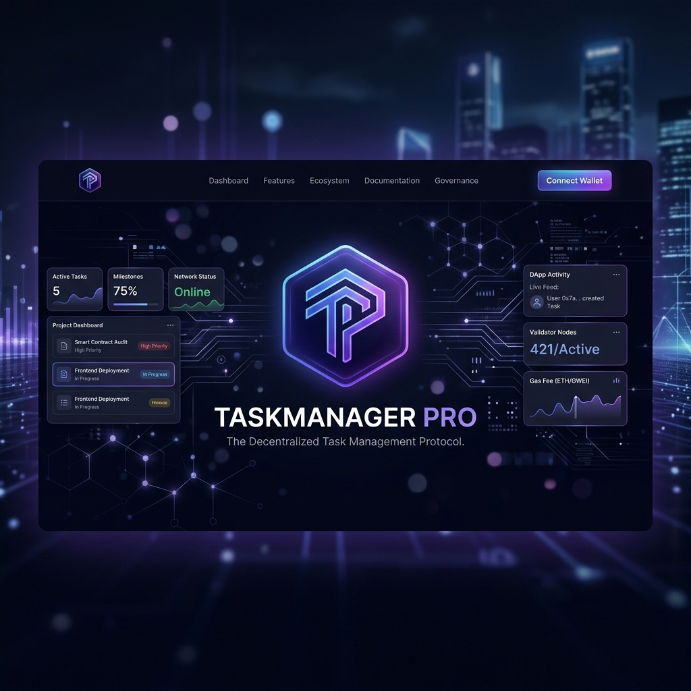

# TaskManager Pro - Decentralized Escrow and Bounty Management Protocol

[](https://opensource.org/licenses/MIT)
[](https://www.rust-lang.org)
[](https://stellar.org)
[](https://nextjs.org)

<div align="center">
  
  <h3>A Decentralized Milestone and Payout Escrow Network on Stellar</h3>
  <p><i>Securely fund, track, and complete professional tasks utilizing automated smart-contract escrows.</i></p>
</div>

---

## Overview

TaskManager Pro is a next-generation decentralized workflow and bounty management system powered by Stellar's Soroban smart contracts. The protocol connects project administrators/creators with developers, ensuring funds are locked securely in on-chain escrows and paid out upon satisfactory work delivery.

By utilizing Stellar's native token transfers and fast ledger times, TaskManager Pro reduces payment counterparty risks, implements platform fee routing, and provides robust dispute resolution mechanisms.

---

## Key Features

| Feature | Description |
|---------|-------------|
| Escrowed Task Creation | Creators fund and launch tasks with rewards locked securely inside the smart contract escrow. |
| Assignment System | Developers claim open tasks, moving the contract status into an active "In Progress" workflow state. |
| Workflow Automation | Enforces structured transitions: Open → InProgress → Completed → Verified. |
| Split Dispute Resolution | In case of disagreement, admins act as mediators to resolve disputes and allocate custom reward splits between creators and assignees. |
| Automated Platform Fees | Platform fees (in basis points) are calculated and routed to a designated fee recipient address upon task completion. |
| Task Cancellations | Creators can cancel open tasks and withdraw locked reward funds if no developer has claimed the work. |
| Contract Method Explorer | Interactive UI that displays all Soroban contract methods with parameter signatures and live stats. |

---

## Architecture

```
┌─────────────────────────────────────────────────────────────┐
│                    TaskManager Pro Contract                  │
├─────────────────────────────────────────────────────────────┤
│                        Storage Layer                         │
│  ┌──────────────┐  ┌──────────────────┐  ┌────────────────┐  │
│  │    Tasks     │  │  Escrow Balances  │  │ Platform Config│  │
│  └──────────────┘  └──────────────────┘  └────────────────┘  │
├─────────────────────────────────────────────────────────────┤
│                      Business Logic                          │
│  ┌──────────────┐  ┌──────────────────┐  ┌────────────────┐  │
│  │ Workflow State│  │ Dispute Arbitrage│  │ Payout Splits  │  │
│  └──────────────┘  └──────────────────┘  └────────────────┘  │
├─────────────────────────────────────────────────────────────┤
│                       Soroban SDK                           │
└─────────────────────────────────────────────────────────────┘
                               │
                               ▼
                     ┌─────────────────────┐
                     │   Stellar Network   │
                     └─────────────────────┘
```

---

## Frontend Project Structure

```
frontend/
├── app/
│   ├── components/
│   │   ├── BountiesPreview.tsx   # Live bounties dashboard with escrow flows
│   │   ├── ContractExplorer.tsx  # Interactive Soroban contract method explorer
│   │   ├── Features.tsx          # Product features section
│   │   ├── Hero.tsx              # Hero section with CTA
│   │   ├── Navbar.tsx            # Navigation bar with brand logo
│   │   ├── Footer.tsx            # Footer links and info
│   │   ├── Logo.tsx              # Brand logo component
│   │   └── CallToAction.tsx      # CTA section
│   ├── layout.tsx                # Root layout with fonts and metadata
│   └── page.tsx                  # Main page assembly
├── public/
│   └── banner.png                # Brand banner image
├── next.config.ts
└── package.json
```

---

## Smart Contract Overview

### Data Schemas

```rust
// Task structure stored on-chain
pub struct Task {
    pub id: u32,
    pub title: String,
    pub description: String,
    pub reward: i128,
    pub assignee: Option<Address>,
    pub status: TaskStatus,
    pub created_by: Address,
    pub tags: Vec<String>,
}

// Enforced task states
pub enum TaskStatus {
    Open,
    InProgress,
    Completed,
    Disputed,
    Verified,
    Cancelled,
}
```

### Core API Methods

*   `initialize(env, admin, platform_fee_bps, token_contract, fee_recipient)`
    Configures contract admin, platform fee percentage (in BPS), token contract address, and designated fee payout destination.
*   `create_task(env, creator, title, description, reward, tags) -> u32`
    Creates a new task. Transports the task reward from the creator to the contract's escrow address.
*   `assign_task(env, assignee, task_id)`
    Claims an open task and changes its status to `InProgress`.
*   `submit_work(env, assignee, task_id, delivery_url)`
    Allows the assignee to submit their delivery link, advancing the status to `Completed`.
*   `complete_task(env, caller, task_id)`
    Releases the locked escrow tokens to the assignee (minus the platform fee) and closes the task.
*   `cancel_task(env, creator, task_id)`
    Cancels an open task and refunds the escrowed tokens back to the creator.
*   `dispute_task(env, caller, task_id)`
    Transitions an active or completed task into a `Disputed` state.
*   `resolve_dispute(env, admin, task_id, creator_refund, assignee_payout)`
    Allows the admin to resolve a dispute by allocating customized reward splits.

---

## Development and Testing

### Running the Frontend

```bash
npm install
npm run dev        # Development server on http://localhost:3000
npm run build      # Production build
```

### Smart Contract (from root repo)

```bash
cd contract
cargo test                                                      # Run all unit tests
cargo build --target wasm32-unknown-unknown --release           # Build WASM binary
```

### Backend API Server (from root repo)

```bash
cd backend
npm install
npm start          # API server on http://localhost:3001
```

---

## Learning Resources

### Stellar Soroban
- [Soroban Documentation](https://soroban.stellar.org/docs)
- [Stellar Developer Discord](https://discord.gg/stellar)
- [Testing Soroban Contracts Reference](https://soroban.stellar.org/docs/fundamentals-and-concepts/testing)

### Rust
- [The Rust Book](https://doc.rust-lang.org/book/)
- [Rust by Example](https://doc.rust-lang.org/rust-by-example/)
